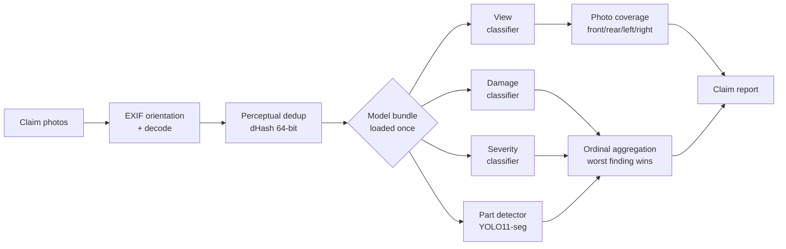

<div align="center">

# ClaimSight

**Automated vehicle damage assessment from claim photos.**
Detects what was photographed, what is damaged, how badly — and which photo the adjuster forgot to take.

[](LICENSE)
[](pyproject.toml)
[](https://pytorch.org)
[](https://github.com/NCH04/Claimsight/actions/workflows/ci.yml)
[](tests/)
[](https://docs.astral.sh/ruff/)


<sub>Real predictions from the part detector on held-out validation images.</sub>

</div>

---

## The problem

An insurance adjuster opening a claim gets a folder of phone photos and has to answer three questions: *what is damaged, how badly, and do I have enough photos to close this file?* The third question is the expensive one — a missing angle means a callback, a delayed claim and an unhappy policyholder.

ClaimSight answers all three from the raw photos, and returns a structured report rather than a probability.

```bash
pip install -e ".[all]"

claimsight --images_dir path/to/claim/photos   # CLI
claimsight-serve                               # HTTP API on :8000, docs at /docs
```

```json
{
  "summary": "Front-left view shows moderate dent damage.",
  "image_level_damage": { "damage": "dent", "severity": "moderate",
                          "confidence": 0.8412, "evidence_image": "IMG_0442.jpg" },
  "missing_photos": ["right"],
  "suspected_total_loss": false,
  "duplicates_removed": 1,
  "confidence": 0.8356
}
```

`missing_photos` is the field that pays for itself.

---

## How it works



Four design decisions carry the system:

**One taxonomy, one file.** Views, damages, severities and parts are defined once in [`claimsight/domain/taxonomy.py`](claimsight/domain/taxonomy.py). The YOLO `data.yaml` is generated from it, so the class-id ↔ name contract cannot drift.

**Checkpoints carry their own preprocessing.** `img_size`, `resize_mode` and `normalize` live inside the `.pt`, and inference rebuilds the transform from them — training and serving cannot diverge.

**Aggregation is ordinal, not confidence-based.** A folder verdict ranks findings by *severity*, so a confidently-predicted `none` can never outweigh a less-confident `dent`. Damage type and severity are read from the same image.

**Business logic has no torch dependency.** Aggregation, deduplication and thresholds live in `claimsight/domain/` and are unit-tested without a GPU or a dataset.

---

## Models

| Model | Task | Status |
|---|---|---|
| **Coverage** | 4 vehicle faces, **multi-label** | 🟢 trained — macro-F1 **0.969**, exact-match **0.927** |
| **Parts** | 15 vehicle parts, instance segmentation | 🟢 trained — mAP50 **0.830** |
| **Damage** | 7 damage types | 🟡 trainable — no licence-compatible dataset yet |
| **Severity** | 4 ordinal levels | 🟡 trainable — no public source |
| **View** | 10 camera orientations | ⚪ optional — superseded by Coverage for the product feature |

### Why coverage is multi-label

The shipped feature — telling an adjuster which angle is missing — only ever
needed four answers: *is the front visible? the rear? the left? the right?*
Ten mutually-exclusive view classes were an indirection: a `front-left` photo
already counted as both front and left.

Predicting the four faces independently is strictly better. **Two diagonal
photos can cover all four faces**, which exclusive classes cannot express;
annotation becomes ticking boxes instead of choosing among ten; and the rare
diagonal classes stop starving the model.

4-fold grouped cross-validation, per face:

| | front | rear | left | right |
|---|---|---|---|---|
| **F1** | 0.983 | 0.958 | 0.967 | 0.969 |

`left` and `right` hold up despite being only ~7% of the training labels —
`pos_weight` in the BCE loss is what keeps the model from answering "absent"
every time. Their higher fold-to-fold variance (±0.014, ±0.026 against ±0.004
for `front`) is the honest signal that they rest on few examples.

> **Read these numbers for what they are.** They measure agreement with labels
> *derived from part annotations*, not with human ground truth. The model
> reproduces that heuristic very well; how it behaves on real phone photos is
> not yet measured.

It also unlocked free training data. Part annotations reveal the camera angle —
a photo labelling a front bumper and headlights shows the front — so
`scripts/derive_coverage_labels.py` extracts **3,393 labelled images** from a
CC BY 4.0 parts dataset without annotating anything by hand. That is weak
supervision: an absent part does not prove an absent face, so it is a
foundation, not a substitute for real annotations — particularly for the side
faces, which are rare in public datasets.

Adding a classifier is a `TaskConfig` entry in [`claimsight/training/tasks.py`](claimsight/training/tasks.py); the trainer is task-agnostic.

```bash
# Free labels derived from part annotations
python scripts/derive_coverage_labels.py --dataset <parts_dataset> \
       --out dataset/coverage_derived.csv
claimsight-train --task coverage --csv_path dataset/coverage_derived.csv \
                 --images_dir <images> --final_fit
```

To add real annotations, `scripts/annotate_coverage.py` serves a keyboard-driven
page — `1-4` toggle faces, `Enter` advances — at two to three seconds per image.
It writes the CSV after every image and resumes where you stopped.

The trainer splits **by vehicle** (`StratifiedGroupKFold`), selects the best epoch on a holdout carved out of the training fold, reports metrics from the best checkpoint, and `--final_fit` retrains on the full dataset to produce the deployable model. Cross-validation gives the estimate; the final fit gives the artefact.


<sub>Class distribution and box geometry of the remapped parts dataset.</sub>

---

## API

```bash
pip install -e ".[api]"
claimsight-serve            # http://127.0.0.1:8000/docs
```

| Route | |
|---|---|
| `POST /api/claims` | Multipart upload → **202** with a `claim_id` |
| `GET /api/claims/{id}` | Status, then the `ClaimReport` once `done` |
| `GET /api/claims/{id}/images/{file}` | Serves a photo; `?thumb=1` for the thumbnail |
| `GET /api/health` | Which models are loaded, and whether the service is usable |

Analysis is **asynchronous**: a claim takes longer than a browser will hold a
request open, so the upload returns an id and the client polls. A React front
end lives in `web/` and is served by the API from `web/dist` in production,
proxied by Vite in development.

```bash
make web-install && make web-build && make serve   # http://127.0.0.1:8000
```

Models load **once** in the FastAPI lifespan, never per request: building three
ResNets and a YOLO costs hundreds of milliseconds. `ModelBundle` was designed
for this from the start.

The Pydantic models in `claimsight/api/schemas.py` are the source of truth for
the output contract — FastAPI derives the OpenAPI document from them, so the
front end gets a typed contract for free rather than a hand-written one.

Uploads are capped (30 files, 25 MB each, image extensions only) and a bad
folder returns 422 rather than 500: `run_pipeline` never raises, so the caller
always gets a usable body.

---

## Image quality

The two defects that actually happen on a roadside phone photo are **blur** and
**under-exposure**, and both deserve a retake rather than a shaky prediction.
Laplacian variance and mean luminance, measured on a downscaled copy so the
verdict does not depend on the camera's resolution.

Under-exposure is checked **before** blur, against intuition: darkness collapses
Laplacian variance on its own, so a dark photo would otherwise be reported as
blurry. The actionable defect is the exposure — *retake it with more light* —
and the blur measurement is not trustworthy on a dark frame anyway.

---

## Calibration

A trained network is almost always **overconfident** — it claims 0.98 where it
is right 85% of the time. Until that is corrected an abstention threshold means
nothing, which is why `MIN_CONFIDENCE` sat at 0.0.

```bash
make calibrate CKPT=models/coverage.pt CSV=dataset/coverage_test.csv IMAGES=<images>
```

Measured on 265 held-out images (the parts dataset's `test` split, used neither
for training nor for cross-validation):

| | before | after |
|---|---|---|
| Expected calibration error | 0.0180 | **0.0105** (−41%) |

Temperature came out at **1.40** — confirming the overconfidence. Accuracy is
untouched: dividing logits by a positive scalar reorders nothing.

The pass also picks a **threshold per class**, and they are nowhere near
uniform: `front` 0.22, `rear` 0.70, `left` 0.47, `right` 0.30. A rare face is
worth declaring present earlier than a common one; a single 0.5 was costing
recall exactly where it could least afford it. Both values are written into the
checkpoint and applied at inference.

---

## Damage attribution

Parts are detected, then each part's **crop** is classified for damage — which
is what lets the report say *front bumper, dented* instead of *something is
dented somewhere*.

Two rules govern the result. The **worst sighting wins**, by ordinal severity:
a wing can look intact head-on and clearly crushed at three-quarters, and it is
the second view that counts. And **only genuinely damaged parts are reported** —
an intact part belongs in `raw_detections`, not in a claim.

`damaged_parts[]` stays empty until a damage classifier exists; the machinery
is in place and tested, and fills the moment one is trained.

---

## Data and licences

Images are never committed. Every source, its licence and what it permits are documented in [`dataset/README.md`](dataset/README.md).

The parts detector trains on [Carparts Segmentation](https://docs.ultralytics.com/datasets/segment/carparts-seg/) (**CC BY 4.0**), remapped to the ClaimSight taxonomy:

```bash
python scripts/remap_yolo_parts.py --src <raw_labels> --dst dataset/parts/labels \
       --mapping configs/source_part_ids_carparts_seg.json --dry_run
python scripts/build_yolo_config.py
claimsight-train-parts --epochs 100 --imgsz 640
```

> **The MIT licence covers the code only.** Datasets and any weights derived from them carry their source's terms, which may be non-commercial.

---

## Project layout

```
claimsight/
├── domain/      taxonomy · aggregation · dedup   (pure Python, no torch)
├── ml/          backbones · transforms · checkpoints · classifier
├── training/    task configs · K-fold trainer · metrics · YOLO trainer
└── pipeline/    orchestration · model bundle · I/O
design/          source of the interface design canvas (.dc.html)
specs/           annotation guidelines · taxonomy · output schema
```

---

## Status

Honest state of play — this is a working pipeline, not a finished product.

| | |
|---|---|
| ✅ | Multi-label photo coverage, perceptual dedup, ordinal aggregation, calibrated thresholds |
| ✅ | Image quality gating — blur and under-exposure flagged before a prediction is trusted |
| ✅ | Part detector trained and evaluated |
| ✅ | Part detection wired end to end — `raw_detections` populated, `damaged_parts` attribution in place |
| ✅ | HTTP API — FastAPI, Pydantic contract, models loaded once at startup |
| 🚧 | Damage and severity classifiers — blocked on licence-compatible training data |
| 🚧 | Side-face coverage — derived labels cover only ~7% left/right; needs manual annotation |

```bash
make test   # 85 tests, no GPU required
make lint
```

---

## License

[MIT](LICENSE) — see the note on datasets and model weights.
