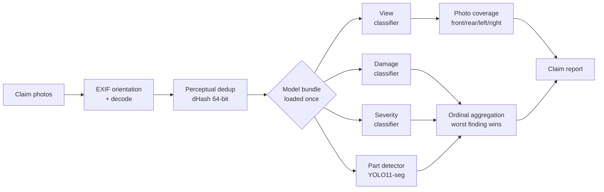

<div align="center">

# ClaimSight

**Automated vehicle damage assessment from claim photos.**
Detects what was photographed, what is damaged, how badly — and which photo the adjuster forgot to take.

[](LICENSE)
[](pyproject.toml)
[](https://pytorch.org)
[](tests/)
[](https://docs.astral.sh/ruff/)


<sub>Real predictions from the part detector on held-out validation images.</sub>

</div>

---

## The problem

An insurance adjuster opening a claim gets a folder of phone photos and has to answer three questions: *what is damaged, how badly, and do I have enough photos to close this file?* The third question is the expensive one — a missing angle means a callback, a delayed claim and an unhappy policyholder.

ClaimSight answers all three from the raw photos, and returns a structured report rather than a probability.

```bash
pip install -e ".[all]"

claimsight --images_dir path/to/claim/photos --view_checkpoint models/view.pt
```

```json
{
  "summary": "Front-left view shows moderate dent damage.",
  "image_level_damage": { "damage": "dent", "severity": "moderate",
                          "confidence": 0.8412, "evidence_image": "IMG_0442.jpg" },
  "missing_photos": ["right"],
  "suspected_total_loss": false,
  "duplicates_removed": 1,
  "confidence": 0.8356
}
```

`missing_photos` is the field that pays for itself.

---

## How it works



Four design decisions carry the system:

**One taxonomy, one file.** Views, damages, severities and parts are defined once in [`claimsight/domain/taxonomy.py`](claimsight/domain/taxonomy.py). The YOLO `data.yaml` is generated from it, so the class-id ↔ name contract cannot drift.

**Checkpoints carry their own preprocessing.** `img_size`, `resize_mode` and `normalize` live inside the `.pt`, and inference rebuilds the transform from them — training and serving cannot diverge.

**Aggregation is ordinal, not confidence-based.** A folder verdict ranks findings by *severity*, so a confidently-predicted `none` can never outweigh a less-confident `dent`. Damage type and severity are read from the same image.

**Business logic has no torch dependency.** Aggregation, deduplication and thresholds live in `claimsight/domain/` and are unit-tested without a GPU or a dataset.

---

## Models

| Model | Task | Status |
|---|---|---|
| **Parts** | 15 vehicle parts, instance segmentation | 🟢 trained — mAP50 **0.754**, mAP50-95 **0.632** |
| **View** | 10 camera orientations | 🟡 trainable — needs in-house annotations |
| **Damage** | 7 damage types | 🟡 trainable — no licence-compatible dataset yet |
| **Severity** | 4 ordinal levels | 🟡 trainable — no public source |

Adding a classifier is a `TaskConfig` entry in [`claimsight/training/tasks.py`](claimsight/training/tasks.py); the trainer is task-agnostic.

```bash
claimsight-train --task view --csv_path dataset/labels.csv \
                 --images_dir dataset/images --final_fit
```

The trainer splits **by vehicle** (`StratifiedGroupKFold`), selects the best epoch on a holdout carved out of the training fold, reports metrics from the best checkpoint, and `--final_fit` retrains on the full dataset to produce the deployable model. Cross-validation gives the estimate; the final fit gives the artefact.


<sub>Class distribution and box geometry of the remapped parts dataset.</sub>

---

## Data and licences

Images are never committed. Every source, its licence and what it permits are documented in [`dataset/README.md`](dataset/README.md).

The parts detector trains on [Carparts Segmentation](https://docs.ultralytics.com/datasets/segment/carparts-seg/) (**CC BY 4.0**), remapped to the ClaimSight taxonomy:

```bash
python scripts/remap_yolo_parts.py --src <raw_labels> --dst dataset/parts/labels \
       --mapping configs/source_part_ids_carparts_seg.json --dry_run
python scripts/build_yolo_config.py
claimsight-train-parts --epochs 100 --imgsz 640
```

> **The MIT licence covers the code only.** Datasets and any weights derived from them carry their source's terms, which may be non-commercial.

---

## Project layout

```
claimsight/
├── domain/      taxonomy · aggregation · dedup   (pure Python, no torch)
├── ml/          backbones · transforms · checkpoints · classifier
├── training/    task configs · K-fold trainer · metrics · YOLO trainer
└── pipeline/    orchestration · model bundle · I/O
design/          source of the interface design canvas (.dc.html)
specs/           annotation guidelines · taxonomy · output schema
```

---

## Status

Honest state of play — this is a working pipeline, not a finished product.

| | |
|---|---|
| ✅ | View classification, photo-coverage detection, perceptual dedup, ordinal aggregation, confidence thresholds |
| ✅ | Part detector trained and evaluated |
| 🚧 | `damaged_parts[]` — the detector is trained but not yet wired into the pipeline output |
| 🚧 | HTTP API (FastAPI) — currently a CLI; the model bundle is already built to load once at startup |
| 🚧 | Damage and severity classifiers — blocked on licence-compatible training data |

```bash
make test   # 32 tests, no GPU required
make lint
```

---

## License

[MIT](LICENSE) — see the note on datasets and model weights.
