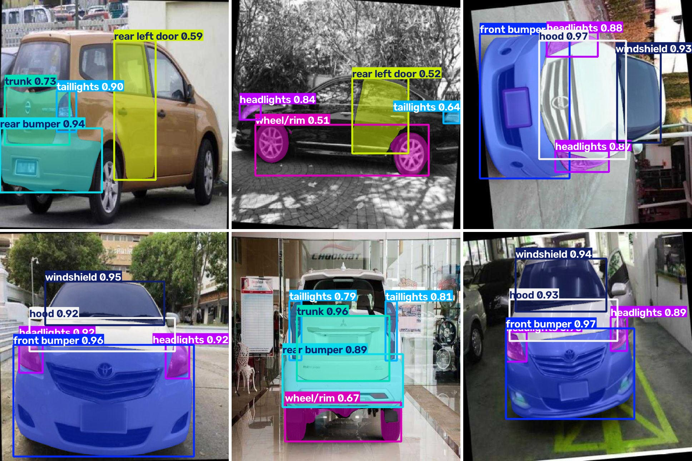
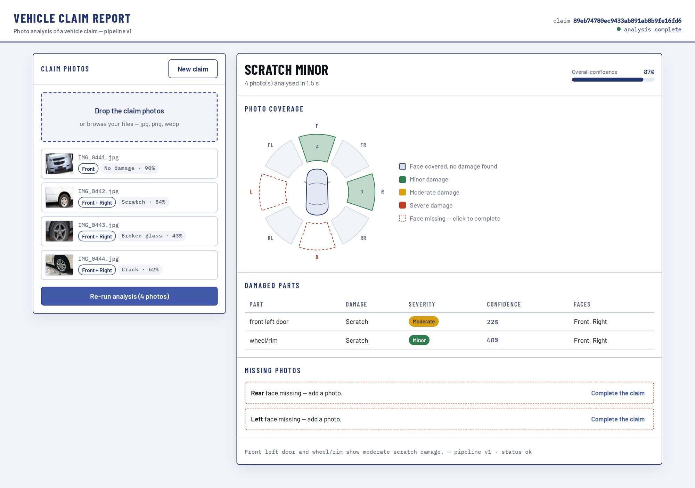
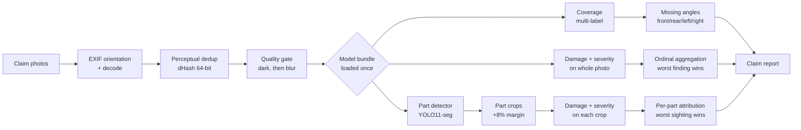
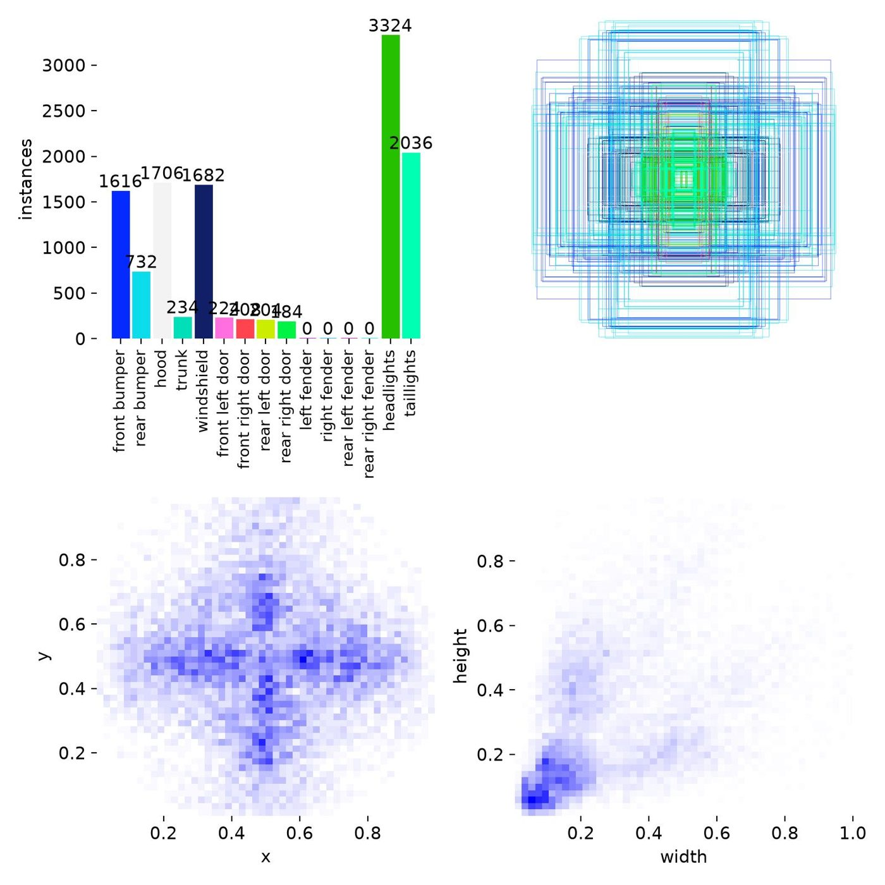
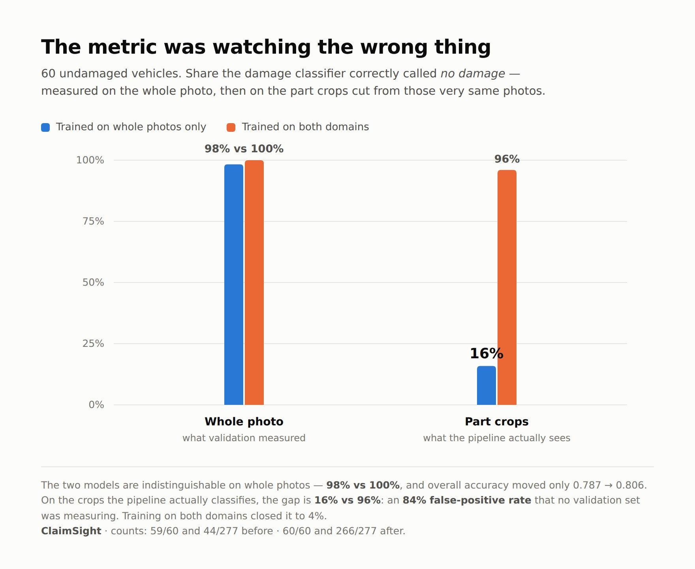

<div align="center">

# ClaimSight

**Automated vehicle damage assessment from claim photos.**
Detects what was photographed, what is damaged, how badly — and which photo the adjuster forgot to take.

[](LICENSE)
[](pyproject.toml)
[](https://pytorch.org)
[](https://github.com/NCH04/Claimsight/actions/workflows/ci.yml)
[](tests/)
[](https://docs.astral.sh/ruff/)



<sub>YOLO11s-seg predictions on held-out validation images — 12 part classes, masks and confidences as the model returns them.</sub>

</div>

---

## Tech stack

| Layer | Stack |
|---|---|
| **Vision** | PyTorch 2.11 · torchvision ResNet-34 · Ultralytics YOLO11s-seg |
| **Training** | scikit-learn `StratifiedGroupKFold` · pandas · fp16 autocast · temperature scaling |
| **Serving** | FastAPI · Pydantic v2 · Uvicorn |
| **Web** | React 18 · TypeScript 5.5 · Vite 5 |
| **Quality** | pytest · Ruff · GitHub Actions · Make |

Four choices are worth the sentence they cost.

**ResNet-34, not a transformer.** Every label traces back to about 3 300
distinct photos. A ViT of comparable capacity would memorise them; an
ImageNet-pretrained ResNet-34 transfers well to sheet metal and trains a fold
in minutes on a laptop GPU — fp16 autocast alone cut epoch time from 2 min to
30 s. More data is the reason to revisit this, not fashion.

**A segmentation detector, consumed as boxes.** The part dataset is annotated
with polygons, so YOLO11**-seg** is what fits it — and polygon supervision
sharpens the boxes even when only boxes are read back. Inference uses the boxes
today; the masks are already there the day damage area in cm² matters.

**Splits grouped by source photo.** The dataset ships ~6 augmented copies of
each photo. Split naively and near-identical frames land on both sides of the
line: an early run scored macro-F1 0.969 that way and 0.904 once grouped. Every
number below the fold is the grouped one.

**Torch stops at the domain boundary.** Aggregation, deduplication, quality
gating and thresholds live in `claimsight/domain/` as pure Python. That is why
102 tests run in five seconds with no GPU and no dataset.

---

## The problem

An insurance adjuster opening a claim gets a folder of phone photos and has to answer three questions: *what is damaged, how badly, and do I have enough photos to close this file?* The third question is the expensive one — a missing angle means a callback, a delayed claim and an unhappy policyholder.

ClaimSight answers all three from the raw photos, and returns a structured report rather than a probability.

```bash
pip install -e ".[all]"

# Weights are not in the repository — 277 MB of .pt files do not belong in git.
# Download them into models/ (see "Getting the weights" below).
curl -L https://github.com/NCH04/Claimsight/releases/latest/download/models.tar.gz \
  | tar -xz

claimsight --images_dir path/to/claim/photos   # CLI
claimsight-serve                               # HTTP API on :8000, docs at /docs
```

```json
{
  "summary": "Front bumper and hood show moderate dent damage.",
  "damaged_parts": [
    { "name": "front bumper", "damage": "dent", "severity": "moderate",
      "confidence": 0.8412, "detected_on": ["IMG_0442.jpg", "IMG_0443.jpg"] }
  ],
  "image_level_damage": { "damage": "dent", "severity": "moderate",
                          "confidence": 0.8412, "evidence_image": "IMG_0442.jpg" },
  "missing_photos": ["right"],
  "suspected_total_loss": false,
  "duplicates_removed": 1,
  "confidence": 0.8356
}
```

`missing_photos` is the field that pays for itself.



<sub>The same report, rendered. Real output from the running pipeline: the
coverage rose shows which faces the photos document and which are still
missing, each part carries the damage read on its own crop, and the adjuster
can complete the claim from the two dashed sectors. React + TypeScript, served
by the API from <code>web/dist</code>.</sub>

---

## How it works



Four design decisions carry the system:

**One taxonomy, one file.** Views, damages, severities and parts are defined once in [`claimsight/domain/taxonomy.py`](claimsight/domain/taxonomy.py). The YOLO `data.yaml` is generated from it, so the class-id ↔ name contract cannot drift.

**Checkpoints carry their own preprocessing.** `img_size`, `resize_mode` and `normalize` live inside the `.pt`, and inference rebuilds the transform from them — training and serving cannot diverge.

**Aggregation is ordinal, not confidence-based.** A folder verdict ranks findings by *severity*, so a confidently-predicted `none` can never outweigh a less-confident `dent`. Damage type and severity are read from the same image.

**One classifier, two domains.** The same damage model reads the whole photo *and* each part crop, so it is trained on both — crops cut exactly as inference cuts them. `make check-skew` measures the gap between the two and exits non-zero if it reopens — it needs weights and images, so it is a pre-release gate rather than a CI step.

---

## Models

All four shipped models are trained, and every figure below comes from
cross-validation **grouped by source photo** — never by file. Grouping is not
a detail: ungrouped, the same coverage model reads 0.927 exact-match instead
of 0.786.

| Model | Task | Headline | Detail |
|---|---|---|---|
| **Parts** | 12 parts, instance segmentation | mAP50 **0.805** · mAP50-95 **0.713** | [↓](#part-detector) |
| **Coverage** | 4 vehicle faces, multi-label | macro-F1 **0.904** · exact-match **0.786** | [↓](#why-coverage-is-multi-label) |
| **Severity** | 4 ordinal levels | macro-F1 **0.822** · off-by-one **0.976** | [↓](#severity-classifier) |
| **Damage** | 6 damage types | macro-F1 **0.698** · accuracy **0.806** | [↓](#damage-classifier) |
| **View** | 10 camera orientations | ⚪ retired — Coverage replaced it | |

Reported as macro-F1 throughout, not accuracy. The classes are heavily
imbalanced — 3 664 `none` against 305 `dent` — and accuracy would let the rare
class disappear behind the common one. Macro-F1 makes the weak class visible,
which is the point of measuring.

### Why coverage is multi-label

The shipped feature — telling an adjuster which angle is missing — only ever
needed four answers: *is the front visible? the rear? the left? the right?*
Ten mutually-exclusive view classes were an indirection: a `front-left` photo
already counted as both front and left.

Predicting the four faces independently is strictly better. **Two diagonal
photos can cover all four faces**, which exclusive classes cannot express;
annotation becomes ticking boxes instead of choosing among ten; and the rare
diagonal classes stop starving the model.

4-fold cross-validation, **grouped by source photo**, per face:

| | front | rear | left | right |
|---|---|---|---|---|
| **F1** | 0.951 | 0.854 | 0.902 | 0.907 |

`left` and `right` hold up (0.90) despite resting on **89 distinct photos** —
`pos_weight` in the BCE loss is what stops the model from answering "absent"
every time. Their wider fold-to-fold spread (±0.018, ±0.029 against ±0.002 for
`front`) is the honest signal that they rest on few examples.

> **Two caveats, both load-bearing.**
>
> **Grouping matters more than it looks.** The source dataset ships ~6 augmented
> copies per photo (rotations), so 3,658 files are really **585 photos**.
> Splitting by file leaks copies of the same photo across folds and inflates
> every metric: the same model scores 0.927 exact-match ungrouped against
> **0.786** grouped. Only the grouped figure means anything, and
> `--group_column photo_id` is what enforces it.
>
> **These labels are derived, not human.** They measure agreement with a rule
> read off part annotations, not with ground truth. How the model behaves on
> real phone photos is still unmeasured.

It also unlocked free training data. Part annotations reveal the camera angle —
a photo labelling a front bumper and headlights shows the front — so
`scripts/derive_coverage_labels.py` extracts **3,393 labelled images** from a
CC BY 4.0 parts dataset without annotating anything by hand. That is weak
supervision: an absent part does not prove an absent face, so it is a
foundation, not a substitute for real annotations — particularly for the side
faces, which are rare in public datasets.

### Part detector

YOLO11s-seg, 12 classes, 3 000 training images. Held-out validation (387
images, 1 538 instances):

| | mAP50 | mAP50-95 |
|---|---|---|
| **Box** | 0.805 | 0.713 |
| **Mask** | 0.815 | 0.692 |

The per-class spread is the interesting part, and it tracks one thing — how
often the part appears:

| Part | mAP50 | val instances | | Part | mAP50 | val instances |
|---|---|---|---|---|---|---|
| front bumper | 0.987 | 208 | | front left door | 0.802 | 15 |
| hood | 0.985 | 214 | | trunk | 0.740 | 14 |
| windshield | 0.983 | 214 | | rear left door | 0.718 | 15 |
| rear bumper | 0.967 | 94 | | front right door | 0.640 | 12 |
| headlights | 0.963 | 429 | | rear right door | 0.538 | 12 |
| taillights | 0.937 | 258 | | wheel/rim | 0.400 | 53 |

Everything a front-facing photo contains is at 0.94 or above. Everything that
needs a side or rear-three-quarter shot sits between 0.54 and 0.80, on twelve
to fifteen validation instances — a number too small to score reliably, let
alone learn from. It is the same scarcity the coverage model runs into, and
public car datasets are photographed from the front.

`wheel/rim` at 0.400 is a different failure. It has 709 training instances, so
this is not scarcity: wheels are annotated inconsistently in the source — often
the front one only, sometimes none — so correct detections are scored as false
positives. It was reinstated in V1 because a buckled rim is evidence of impact
in its own right; the number says it needs its annotations cleaned before it
can be trusted.

### Damage classifier

ResNet-34 over 10 583 examples — 3 882 whole photos and 6 701 part crops —
drawn from 3 284 distinct photos. 4-fold cross-validation grouped by photo:

**accuracy 0.806 ± 0.005 · macro-F1 0.698 ± 0.003**

| Class | P | R | F1 | support | examples |
|---|---|---|---|---|---|
| `none` | 0.968 | 0.952 | **0.960** | 916 | 3 664 |
| `broken_glass` | 0.907 | 0.877 | **0.891** | 546 | 2 186 |
| `scratch` | 0.728 | 0.755 | **0.741** | 437 | 1 748 |
| `deformation_impact` | 0.681 | 0.651 | **0.665** | 366 | 1 462 |
| `crack` | 0.594 | 0.598 | **0.595** | 304 | 1 218 |
| `dent` | 0.295 | 0.409 | **0.339** | 76 | 305 |

The ranking is the class-count column, in order. `dent` is the one that hurts,
and it is not a modelling problem: a shallow dent on a curved panel is a
gradient, and 305 examples is not enough to learn one. It is also the class an
adjuster cares about most, which is why it is named in **Status** rather than
averaged away — macro-F1 is reported precisely because it refuses to hide it.

`missing_part` is declared in the taxonomy but has **no source data** in this
dataset version, so the model ships with 6 classes, not 7. A class that can
never be predicted is worse than an absent one, so the trainer drops it rather
than pretending.

> These metrics were measured **before** the crop domain was added, at
> macro-F1 0.648 — and the whole-photo accuracy barely moved, 0.787 → 0.806.
> The number that moved was the one no validation set was measuring. See
> [the skew section](#the-skew-that-crop-attribution-exposes).

### Severity classifier

Same dataset, same split, one ordinal twist: `none < minor < moderate <
severe` is a scale, so being wrong by one level is not the same mistake as
being wrong by three.

**accuracy 0.837 ± 0.004 · macro-F1 0.822 ± 0.005 · off-by-one accuracy 0.976**

| Class | P | R | F1 | support |
|---|---|---|---|---|
| `none` | 0.964 | 0.968 | **0.966** | 916 |
| `severe` | 0.897 | 0.867 | **0.882** | 539 |
| `minor` | 0.711 | 0.764 | **0.736** | 532 |
| `moderate` | 0.719 | 0.690 | **0.704** | 659 |

The two ends of the scale are solid and the middle is where it hesitates,
which is the failure mode you want: `minor` and `moderate` are adjacent, and
telling them apart is a judgement two human adjusters also argue about.
`severe` — the level that triggers a write-off review — is read at 0.882.

**Mean ordinal error is 0.19 levels, and 97.6% of predictions land within one
level of the truth.** That is the number that matters for a claim: the model
essentially never calls a write-off a scratch. Plain accuracy cannot see this,
which is why `TaskConfig` carries an `ordinal` flag and the trainer reports
both.

Adding a classifier is a `TaskConfig` entry in [`claimsight/training/tasks.py`](claimsight/training/tasks.py); the trainer is task-agnostic.

```bash
# Free labels derived from part annotations
python scripts/derive_coverage_labels.py --dataset <parts_dataset> \
       --out dataset/coverage_derived.csv
claimsight-train --task coverage --csv_path dataset/coverage_derived.csv \
                 --images_dir <images> --final_fit
```

To add real annotations, `scripts/annotate_coverage.py` serves a keyboard-driven
page — `1-4` toggle faces, `Enter` advances — at two to three seconds per image.
It writes the CSV after every image and resumes where you stopped.

The trainer splits **by vehicle** (`StratifiedGroupKFold`), selects the best epoch on a holdout carved out of the training fold, reports metrics from the best checkpoint, and `--final_fit` retrains on the full dataset to produce the deployable model. Cross-validation gives the estimate; the final fit gives the artefact.



<sub>Class distribution and box geometry of the remapped parts dataset. The imbalance is the whole story: 3,324 headlight instances against 184 for the rear right door, and the per-class mAP follows that curve exactly.</sub>

---

## API

```bash
pip install -e ".[api]"
claimsight-serve            # http://127.0.0.1:8000/docs
```

| Route | |
|---|---|
| `POST /api/claims` | Multipart upload → **202** with a `claim_id` |
| `GET /api/claims/{id}` | Status, then the `ClaimReport` once `done` |
| `GET /api/claims/{id}/images/{file}` | Serves a photo; `?thumb=1` for the thumbnail |
| `GET /api/health` | Which models are loaded, and whether the service is usable |

Analysis is **asynchronous**: a claim takes longer than a browser will hold a
request open, so the upload returns an id and the client polls. A React front
end lives in `web/` and is served by the API from `web/dist` in production,
proxied by Vite in development.

```bash
make web-install && make web-build && make serve   # http://127.0.0.1:8000
```

Models load **once** in the FastAPI lifespan, never per request: building three
ResNets and a YOLO costs hundreds of milliseconds. `ModelBundle` was designed
for this from the start.

The Pydantic models in `claimsight/api/schemas.py` are the source of truth for
the output contract — FastAPI derives the OpenAPI document from them, so the
front end gets a typed contract for free rather than a hand-written one.

Uploads are capped (30 files, 25 MB each, image extensions only) and a bad
folder returns 422 rather than 500: `run_pipeline` never raises, so the caller
always gets a usable body.

---

## Image quality

The two defects that actually happen on a roadside phone photo are **blur** and
**under-exposure**, and both deserve a retake rather than a shaky prediction.
Laplacian variance and mean luminance, measured on a downscaled copy so the
verdict does not depend on the camera's resolution.

Under-exposure is checked **before** blur, against intuition: darkness collapses
Laplacian variance on its own, so a dark photo would otherwise be reported as
blurry. The actionable defect is the exposure — *retake it with more light* —
and the blur measurement is not trustworthy on a dark frame anyway.

---

## Calibration

A trained network is almost always **overconfident** — it claims 0.98 where it
is right 85% of the time. Until that is corrected an abstention threshold means
nothing, which is why `MIN_CONFIDENCE` sat at 0.0.

```bash
make calibrate CKPT=models/coverage.pt CSV=dataset/coverage_test.csv IMAGES=<images>
```

Measured on 764 held-out images, used neither for training nor for
cross-validation:

| | before | after |
|---|---|---|
| Expected calibration error | 0.0251 | **0.0171** (−32%) |

Temperature came out at **1.52** — confirming the overconfidence.
Accuracy is untouched: dividing logits by a positive scalar reorders nothing.

The pass also picks a **threshold per class**, and they are nowhere near
uniform: `front` 0.31, `rear` 0.62, `left` 0.91,
`right` 0.53. `left` needing 0.91 against `front`'s
0.31 is the model telling you it is unsure about side faces — the
same 89 photos that widen their fold-to-fold spread. A single 0.5 would have
been wrong in both directions at once. Both values are written into the
checkpoint and applied at inference.

### Calibrating a model that saw everything

`--final_fit` retrains on 100% of the data to produce the deployable artefact,
which leaves nothing unseen to calibrate it against. Fitting a temperature on
data the model memorised returns a number close to 1 for the wrong reason.

The way out costs no data. The four fold checkpoints are still on disk, and
each one never saw its own validation fold — so replaying the split and letting
each fold model predict only its own fold yields **clean predictions covering
every one of the 10 583 examples**. `--oof_from` does exactly that, reusing the
trainer's own splitter, strata and seed so the folds are the ones that were
actually trained.

| | temperature | ECE before | ECE after |
|---|---|---|---|
| **Severity** | 1.13 | 0.0381 | **0.0202** (−47%) |
| **Damage** | 1.00 | 0.0384 | **0.0381** (−1%) |

Severity was overconfident and the correction nearly halved its calibration
error. Damage came back at **0.996 — already calibrated**, and that is a result
rather than a failure: the trainer applies `label_smoothing=0.05` and class
weights, and label smoothing is a confidence penalty applied during training.
It had already done what temperature scaling would have done afterwards.

Worth knowing before trusting a number like this: temperature scaling cannot
improve accuracy, only the honesty of the confidence attached to it. A model
that is wrong stays wrong — it just stops claiming 0.98 about it.

---

## Damage attribution

Parts are detected, then each part's **crop** is classified for damage — which
is what lets the report say *front bumper, dented* instead of *something is
dented somewhere*.

Two rules govern the result. The **worst sighting wins**, by ordinal severity:
a wing can look intact head-on and clearly crushed at three-quarters, and it is
the second view that counts. And **only genuinely damaged parts are reported** —
an intact part belongs in `raw_detections`, not in a claim.

### The skew that crop attribution exposes

Training the damage classifier on whole photos and serving it on crops is a
train/serve skew, and it does not announce itself — accuracy on the validation
set stays where you left it.

It shows up the moment you measure the two domains on **the same 60 images**
of intact cars — `make check-skew`:

| | whole photo | part crops | false positives |
|---|---|---|---|
| **Trained on photos only** | 59 / 60 `none` | 44 / 277 `none` | **84%** |
| **Trained on both domains** | 60 / 60 `none` | 266 / 277 `none` | **4%** |



The first row is a classifier that knows a car is undamaged when it sees the
whole car, and sees damage on 84% of its parts when shown them one at a time.
Nothing in the loss curve says so — the whole-photo accuracy was 0.787 either
way. The figure is generated by [`docs/figures/train-serve-skew.html`](docs/figures/train-serve-skew.html).

The cause is the negatives, not the model. Every `none` example was a whole
vehicle, so *"intact"* had been learnt as *"looks like a whole car"* — a
property no crop has.

The fix is to train on both domains. [`scripts/derive_damage_crops.py`](scripts/derive_damage_crops.py)
cuts each annotated damage polygon to its bounding box, with the same 8% margin
`Detection.crop` uses at inference, and cuts the parts of intact vehicles the
same way for the negatives. Mixed with the whole-photo rows, the training set
covers what the model is actually asked at serving time.

It paid twice. The false-positive rate on crops fell from 84% to 4%, and
because every damage polygon becomes its own example, `dent` — the starved
class — went from 95 examples to 305 and its F1 from 0.216 to 0.339.

---

## Getting the weights

`models/` is git-ignored: four checkpoints weigh 277 MB, and a repository is
not an artefact store. Each release ships them as one archive.

```bash
curl -L https://github.com/NCH04/Claimsight/releases/latest/download/models.tar.gz | tar -xz
make sanity IMAGES=path/to/photos    # verifies the pipeline end to end
```

| File | Size | What it is |
|---|---|---|
| `models/parts.pt` | 20 MB | YOLO11s-seg, 12 part classes |
| `models/coverage.pt` | 85 MB | ResNet-34, 4 faces, multi-label, calibrated |
| `models/damage.pt` | 85 MB | ResNet-34, 6 damage types, calibrated |
| `models/severity.pt` | 85 MB | ResNet-34, 4 ordinal levels, calibrated |

The `.calibration.json` next to each checkpoint records how its temperature was
obtained; the temperature itself is already inside the `.pt`, along with the
preprocessing contract.

Without them the pipeline refuses to start and tells you both ways out — this
download, or training your own. It never runs silently on missing models.

> **These weights are derived from CC BY 4.0 datasets and inherit those terms.**
> Attribution is required wherever they are redistributed; the two notices are
> in [`dataset/README.md`](dataset/README.md). The Apache 2.0 licence covers
> the code, not the weights.

---

## Data and licences

Images are never committed. Every source, its licence and what it permits are documented in [`dataset/README.md`](dataset/README.md).

| Dataset | Licence | Used for |
|---|---|---|
| [Carparts Segmentation](https://docs.ultralytics.com/datasets/segment/carparts-seg/) | CC BY 4.0 | Part detector · `none` examples |
| [Car Damage Severity](https://universe.roboflow.com/car-damaged-detection-e66m0/car-damaged-severity-detection) (Roboflow Universe) | CC BY 4.0 | Damage type · severity |

Licences are read from the Roboflow API **before** anything is downloaded —
four candidate datasets were queried, all four came back CC BY 4.0. A dataset
whose terms you cannot check is a dataset you cannot ship, so the fetch script
refuses anything outside an allow-list rather than leaving it to a reviewer:

```bash
export ROBOFLOW_API_KEY=...   # read from the environment only, never a flag
make fetch-damage             # prints the licence, then declines or downloads
```

The damage dataset's classes encode type *and* level in one label
(`severe-deformation` → `deformation_impact` + `severe`), so it trains both
classifiers. The correspondence lives in
[`configs/source_damage_ids.json`](configs/source_damage_ids.json) — a config
file, not a branch in the code.

The parts detector is remapped to the ClaimSight taxonomy the same way:

```bash
python scripts/remap_yolo_parts.py --src <raw_labels> --dst dataset/parts/labels \
       --mapping configs/source_part_ids_carparts_seg.json --dry_run
python scripts/build_yolo_config.py
claimsight-train-parts --epochs 100 --imgsz 640
```

> **The Apache 2.0 licence covers the code only.** Datasets and any weights derived from them carry their source's terms, which may be non-commercial.

---

## Project layout

```
claimsight/
├── domain/      taxonomy · aggregation · dedup · quality   (pure Python, no torch)
├── ml/          backbones · transforms · checkpoints · classifier · detector
├── training/    task configs · K-fold trainer · metrics · calibration · YOLO trainer
└── pipeline/    orchestration · model bundle · I/O
scripts/         data acquisition, label derivation and audits — see below
web/             React front end (Vite, built into web/dist and served by the API)
design/          source of the interface design canvas (.dc.html)
specs/           annotation guidelines · taxonomy · output schema
```

The data path is deliberately a chain of small scripts rather than one
pipeline, so each step can be inspected and re-run on its own:

| Script | Role |
|---|---|
| `fetch_roboflow_dataset.py` | Download, licence checked first — refuses anything outside the allow-list |
| `remap_yolo_parts.py` | Source part ids → ClaimSight taxonomy |
| `derive_coverage_labels.py` | Camera angle inferred from part annotations |
| `derive_damage_labels.py` | One row per photo, worst finding wins |
| `derive_damage_crops.py` | One row per damage polygon, cut like inference cuts |
| `merge_label_csv.py` | Both domains into one training set, `photo_id` preserved |
| `build_yolo_config.py` | `data.yaml` generated from the taxonomy, verified in CI |
| `check_domain_skew.py` | Fails if the classifier stops seeing crops as it sees photos |

---

## Status

Honest state of play — this is a working pipeline, not a finished product.

| | |
|---|---|
| ✅ | Multi-label photo coverage, perceptual dedup, ordinal aggregation, calibrated thresholds |
| ✅ | Image quality gating — blur and under-exposure flagged before a prediction is trusted |
| ✅ | Part detector trained and evaluated |
| ✅ | Part detection wired end to end — `raw_detections` and `damaged_parts` both populated |
| ✅ | Damage and severity classifiers trained on CC BY 4.0 data, in both the whole-photo and crop domains |
| ✅ | HTTP API — FastAPI, Pydantic contract, models loaded once at startup · React front end |
| ✅ | Crop-domain skew closed — false positives on part crops down from 84% to 4% |
| 🚧 | `dent` at F1 0.339 — 305 examples against 2 186 for `broken_glass`; the fix is data, not architecture |
| ✅ | All three classifiers calibrated — coverage on a holdout, damage and severity out-of-fold |
| 🚧 | `MIN_CONFIDENCE` is still 0.0 — the confidences are trustworthy now, but the precision/recall trade-off of an abstention threshold has not been measured |
| 🚧 | Side-face coverage — derived labels cover only ~7% left/right; public car photos are shot from the front |
| 🚧 | `wheel/rim` detection — inconsistent source annotations cap it at 0.400 mAP50 |
| 🚧 | `missing_part` has no training data in this dataset version, so the damage model ships with 6 classes |
| 🚧 | No evaluation on real phone photos — every number here comes from public datasets |

```bash
make test   # 102 tests, no GPU required
make lint
```

---

## License

[Apache 2.0](LICENSE) — see the note on datasets and model weights.
